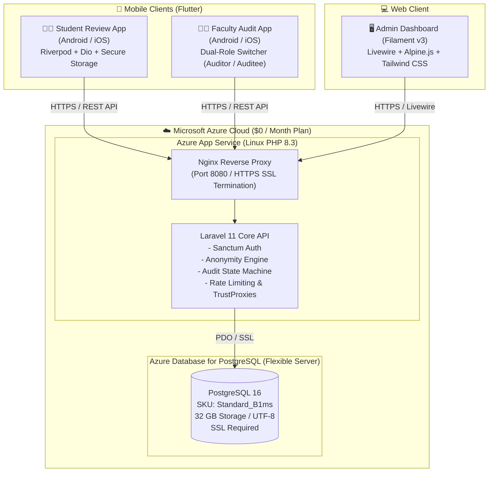
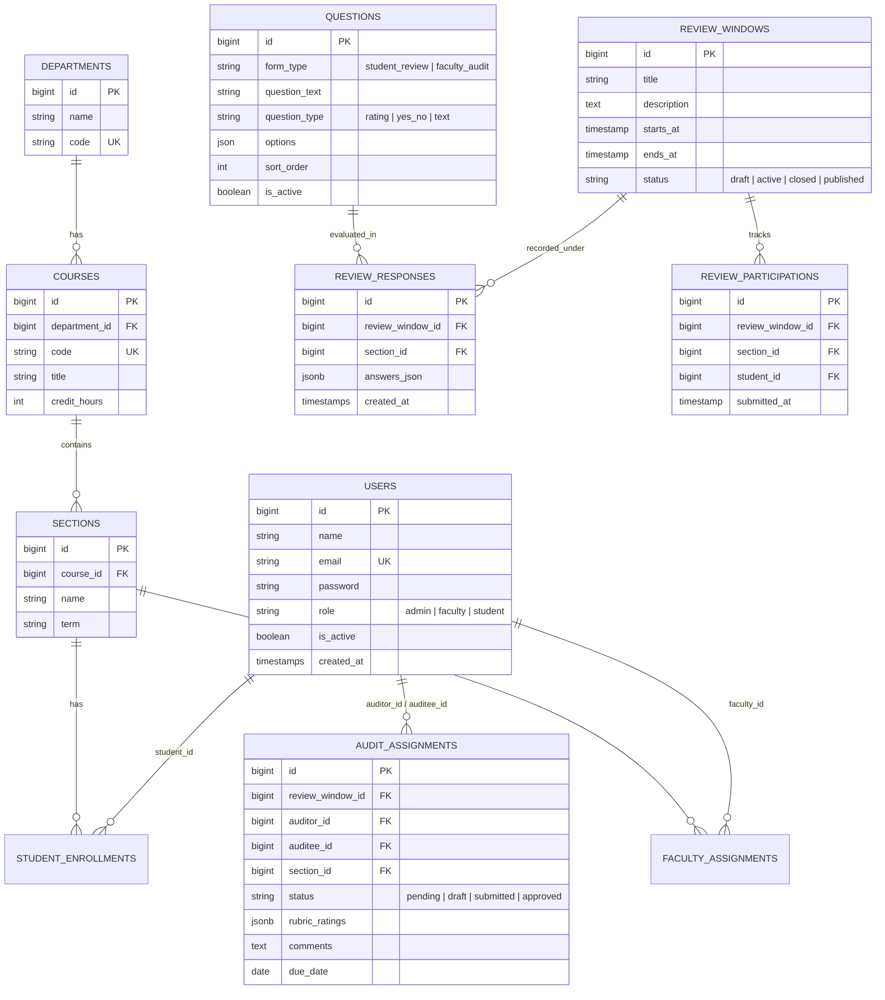
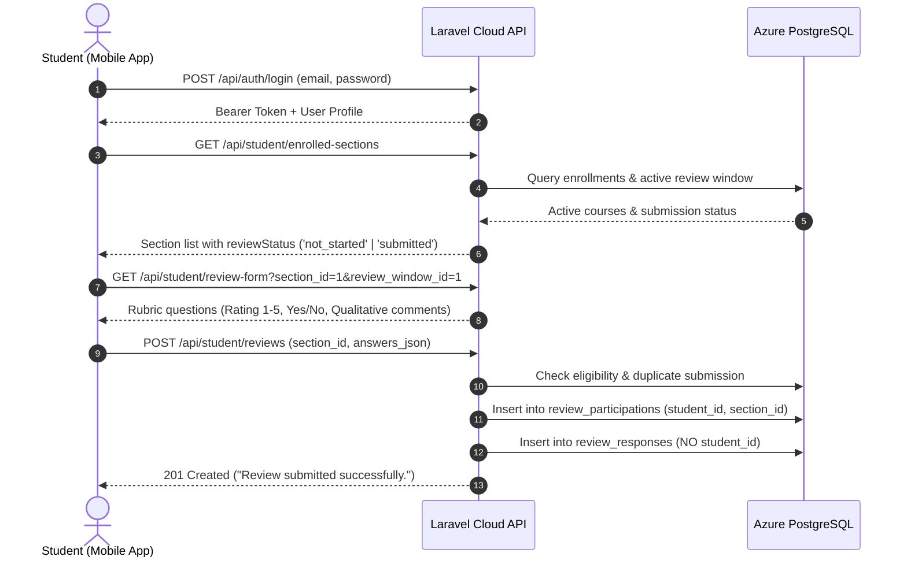
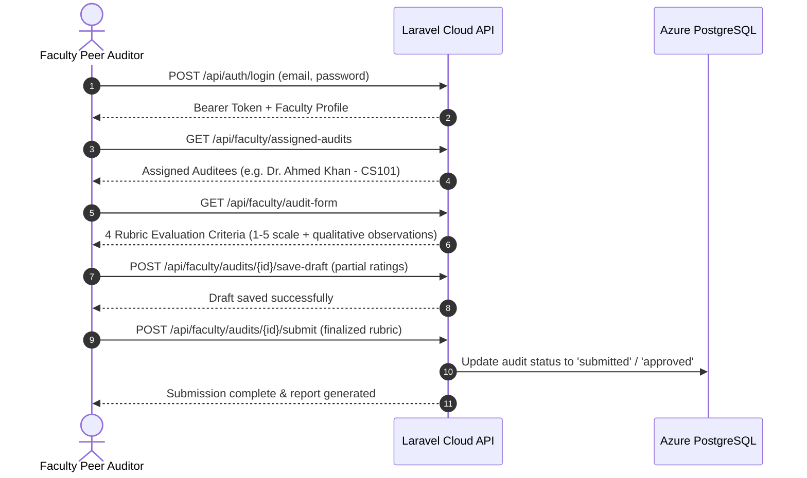

# 🎓 FASRE — Faculty Audit & Student Review Ecosystem
### Comprehensive Project Architecture, API Reference, Cloud Infrastructure & Demo Guide

---

## 📌 1. Project Overview & Problem Statement

**FASRE (Faculty Audit and Student Review Ecosystem)** is an enterprise academic quality assurance platform designed for higher education institutions. It bridges the critical gap between **student course feedback** and **faculty peer evaluation** into a unified, secure, cloud-native ecosystem.

### 🛑 The Problem
- Traditional academic evaluation relies on fragmented paper forms, isolated Google Forms, or cumbersome intranet-only portals.
- Student feedback often lacks guaranteed anonymity, resulting in low participation and biased responses.
- Faculty peer review (classroom audits, teaching assessments) is disconnected from institutional KPI dashboards.
- Localhost/LAN setups fail when demonstrating across different networks or mobile devices.

### 💡 The Solution
- **A 3-Tier Enterprise Ecosystem**:
  1. **Central Admin & Analytics Portal** (Laravel 11 + Filament v3).
  2. **Student Review Mobile Application** (Flutter / Dart + Riverpod).
  3. **Faculty Peer Audit Mobile Application** (Flutter / Dart + Riverpod + Dual-Role Context Switcher).
- **Zero-Trust Anonymous Response Pipeline**: Cryptographically detached survey participation prevents linking individual students to their submitted ratings and qualitative comments while strictly enforcing one submission per student per section.
- **Production Cloud Deployment**: Hosted 24/7 on **Microsoft Azure** (Azure App Service + Azure PostgreSQL Flexible Server) under the **Azure for Students** program at **$0 / month**.

---

## 🏗️ 2. High-Level System Architecture



---

## 🧰 3. Technology Stack Breakdown

| Component | Technology | Version | Purpose |
| :--- | :--- | :--- | :--- |
| **Backend Framework** | Laravel | `11.x` | Core REST API, business logic, authorization policies, migration pipeline |
| **Admin Panel** | Filament PHP | `v3.x` | TALL stack (Tailwind, Alpine, Laravel, Livewire) institutional administration |
| **Database** | PostgreSQL | `16.x` | Relational ACID database with SSL encryption and JSONB support |
| **Authentication** | Laravel Sanctum | `v4.x` | Stateful session authentication (Admin) + API Bearer Tokens (Mobile Apps) |
| **Student Mobile App** | Flutter / Dart | `3.27+` / `Dart 3.6+` | Material 3 mobile app for student course evaluations and inbox notifications |
| **Faculty Mobile App** | Flutter / Dart | `3.27+` / `Dart 3.6+` | Material 3 mobile app for peer audit assignments, rubric grading & reports |
| **Mobile State Mgmt** | Riverpod | `2.x` | Reactive dependency injection and global authentication/role state handling |
| **Mobile Networking** | Dio | `5.x` | HTTP client with automatic token interceptors and base URL resolution |
| **Mobile Secure Storage** | Flutter Secure Storage | `9.x` | Encrypted Keystore/Keychain token and profile persistence |
| **Web Server / Proxy** | Nginx + PHP-FPM | `8.3` | Reverse proxy and PHP worker runtime in Azure Linux container |
| **Cloud Hosting** | Microsoft Azure | Students Tier | App Service (F1 Free) + PostgreSQL Flexible Server (Burstable B1ms Free) |

---

## 🗄️ 4. Database Schema & Entity Relationships



### 🔒 Anonymity & Data Integrity Guarantee:
1. **Separation of Participation vs. Responses**: When a student submits a review:
   - A `review_participations` record is created with `student_id`, `section_id`, and `review_window_id`. This prevents duplicate submissions.
   - The actual feedback answers (`answers_json`) are stored in `review_responses` **without** any `student_id` or IP address column. There is no cryptographic link or foreign key joining the two tables.
2. **K-Anonymity Response Suppression**: If fewer than **5 students** have submitted reviews for a section, aggregated reports suppress question breakdown scores (`is_suppressed: true`) to prevent faculty from deducing student identities.

---

## 🔄 5. Core Business Workflows

### 5.1 Student Review Lifecycle


---

### 5.2 Faculty Peer Audit Lifecycle


---

## 📡 6. REST API Endpoints Reference

### 6.1 Authentication APIs (Public / Protected)

| Method | Endpoint | Auth | Description |
| :--- | :--- | :--- | :--- |
| `POST` | `/api/auth/login` | None | Authenticate user and issue Sanctum token with user role payload. |
| `POST` | `/api/auth/logout` | Bearer Token | Revoke the current access token. |
| `GET` | `/api/me` | Bearer Token | Return the authenticated user profile. |
| `GET` | `/api/notifications` | Bearer Token | Fetch user inbox notifications. |

---

### 6.2 Student APIs (`/api/student/*`) — Requires Role `student`

| Method | Endpoint | Query / Body Params | Description |
| :--- | :--- | :--- | :--- |
| `GET` | `/api/student/enrolled-sections` | None | Lists enrolled courses, section faculty, and submission status. |
| `GET` | `/api/student/review-windows/active` | None | Returns the currently open review cycle window. |
| `GET` | `/api/student/review-form` | `section_id`, `review_window_id` | Returns active rubric questions for the course evaluation. |
| `POST` | `/api/student/reviews` | `section_id`, `review_window_id`, `answers_json` | Submits anonymous student feedback. |
| `GET` | `/api/student/review-results/published` | None | Returns published evaluation results for enrolled sections. |

---

### 6.3 Faculty Audit APIs (`/api/faculty/*`) — Requires Role `faculty`

| Method | Endpoint | Query / Body Params | Description |
| :--- | :--- | :--- | :--- |
| `GET` | `/api/faculty/assigned-audits` | None | Lists assigned peer audits with status and due dates. |
| `GET` | `/api/faculty/audits/{id}` | None | Fetches audit details for a specific assignment. |
| `GET` | `/api/faculty/audit-form` | None | Returns the standardized peer audit rubric criteria. |
| `POST` | `/api/faculty/audits/{id}/save-draft` | `rubric_ratings`, `comments` | Saves in-progress audit evaluation as draft. |
| `POST` | `/api/faculty/audits/{id}/submit` | `rubric_ratings`, `comments` | Finalizes and submits the peer evaluation. |
| `GET` | `/api/faculty/my-submissions` | None | Returns history of submitted audits conducted by this faculty. |
| `GET` | `/api/faculty/my-reports` | None | Returns peer evaluation reports received as an auditee. |

---

### 6.4 Admin APIs (`/api/admin/*`) — Requires Role `admin`

| Method | Endpoint | Description |
| :--- | :--- | :--- |
| `GET/POST` | `/api/admin/users` | Manage students, faculty, and administrators. |
| `GET/POST` | `/api/admin/departments` | Manage university academic departments. |
| `GET/POST` | `/api/admin/courses` | Manage course catalog and credit hours. |
| `GET/POST` | `/api/admin/sections` | Manage section offerings per term. |
| `GET/POST` | `/api/admin/faculty-assignments` | Assign faculty members to course sections. |
| `GET/POST` | `/api/admin/student-enrollments` | Enroll students into course sections. |
| `GET/POST` | `/api/admin/questions` | Manage dynamic question templates and rubrics. |
| `GET/POST` | `/api/admin/review-windows` | Schedule and activate review cycles. |
| `POST` | `/api/admin/review-windows/{id}/activate` | Open evaluation window for student submissions. |
| `POST` | `/api/admin/review-windows/{id}/close` | Close window and stop accepting new reviews. |
| `POST` | `/api/admin/review-windows/{id}/publish-results` | Publish aggregated analytics to faculty and students. |
| `GET` | `/api/admin/review-results` | View institution-wide aggregated evaluation results. |

---

## ☁️ 7. Microsoft Azure Cloud Deployment Architecture

The system is hosted on **Microsoft Azure** using benefits provided by the **GitHub Student Developer Pack (Azure for Students)**.

### 💰 Zero-Cost Allocation Breakdown ($0 / month)
- **Azure App Service Plan (`fasre-app-plan`)**: Linux **`F1` (Free)** tier ($0/mo, 60 CPU-minutes/day).
- **Azure Database for PostgreSQL (`fasre-postgres-srv`)**: **`Standard_B1ms`** (1 vCore, 2 GiB RAM, 32 GB Storage) — **100% Free Monthly Allowance** (750 compute hours + 32 GB storage/month included free in Azure for Students).
- **SSL / HTTPS Termination**: Automated through Azure Edge SSL (`*.azurewebsites.net`).

### ⚙️ Production Web App Configuration
- **Live URL**: `https://fasre-api-srv.azurewebsites.net`
- **Admin Panel**: `https://fasre-api-srv.azurewebsites.net/admin`
- **Nginx Configuration**: Custom server block configured in `default` routing requests to `/home/site/wwwroot/public` with PHP-FPM socket handler.
- **HTTPS Enforcement**: `AppServiceProvider::boot()` forces `URL::forceScheme('https')` and `bootstrap/app.php` trusts Azure reverse proxies via `$middleware->trustProxies(at: '*')`.
- **Startup Command**:
  ```bash
  cp /home/site/wwwroot/default /etc/nginx/sites-available/default; cp /home/site/wwwroot/default /etc/nginx/sites-enabled/default; service nginx reload; /home/site/wwwroot/startup.sh; php-fpm;
  ```
- **Continuous Deployment**: Connected directly to GitHub repository: `https://github.com/HussainRizvi-12/fasre-backend.git` (Branch: `main`).

---

## 📱 8. Mobile Applications & Build Guide

Both mobile apps are built with Flutter and configured to automatically connect to the live Azure backend.

### 8.1 Student Review App
- **Directory**: `c:\Users\Hussain\Desktop\New FYP\Student Review App`
- **Compiled APK**: [`APKs/Student_Review_App.apk`](file:///c:/Users/Hussain/Desktop/New%20FYP/APKs/Student_Review_App.apk)
- **Key Features**:
  - Auto-connecting live session store (`defaultBaseUrl = 'https://fasre-api-srv.azurewebsites.net'`).
  - Active review cycle banner & remaining days countdown.
  - Course card status badges (`Not Started`, `Submitted`).
  - Multi-step survey interface (5-star ratings, Likert scale, comments).
  - Published results viewer and notifications center.
  - Instant reactive state refresh on login via Riverpod.

### 8.2 Faculty Peer Audit App
- **Directory**: `c:\Users\Hussain\Desktop\New FYP\Faculty Audit`
- **Compiled APK**: [`APKs/Faculty_Audit_App.apk`](file:///c:/Users/Hussain/Desktop/New%20FYP/APKs/Faculty_Audit_App.apk)
- **Key Features**:
  - Dual-role switcher (`Auditor View` ⇄ `Auditee View`) with instant Riverpod provider invalidation.
  - Assigned peer classroom audits list with overdue status flags.
  - Draft saving (`Save Draft`) and final submission with validation.
  - Institutional peer audit rubric evaluation form.
  - Historical reports received as auditee.

### 8.3 Compilation Commands (For Future Builds)
```bash
# Build Student Review APK
cd "c:\Users\Hussain\Desktop\New FYP\Student Review App"
flutter build apk --release
copy build\app\outputs\flutter-apk\app-release.apk "..\APKs\Student_Review_App.apk"

# Build Faculty Audit APK
cd "c:\Users\Hussain\Desktop\New FYP\Faculty Audit"
flutter build apk --release
copy build\app\outputs\flutter-apk\app-release.apk "..\APKs\Faculty_Audit_App.apk"
```

---

## 🔑 9. Demo Accounts & Testing Cheat Sheet

All demo accounts share the password: **`Password@123`**

| Role | Name | Email | Password | Primary Demo Responsibilities |
| :--- | :--- | :--- | :--- | :--- |
| **System Admin** | System Admin | `admin@fasre.test` | `Password@123` | Log in at `/admin/login`, manage courses, trigger review windows, publish results. |
| **Student** | Ali Hassan | `ali.hassan@fasre.test` | `Password@123` | Log in to Student App, submit course evaluation for CS101, view published results. |
| **Student** | Bilal Ahmed | `bilal.ahmed@fasre.test` | `Password@123` | Secondary student account for multi-user review submission tests. |
| **Faculty Auditor** | Dr. Usman Raza | `usman.raza@fasre.test` | `Password@123` | Log in to Faculty App, conduct classroom audit for Dr. Ahmed Khan, save draft & submit. |
| **Faculty Auditee** | Dr. Sara Ali | `sara.ali@fasre.test` | `Password@123` | Log in to Faculty App, view feedback reports received from auditors. |
| **Dual-Role Faculty** | Dr. Ahmed Khan | `ahmed.khan@fasre.test` | `Password@123` | Demonstrates dual-role switcher (acts as Auditor in one section, Auditee in another). |

---

## 🎬 10. Step-by-Step Final Year Project (FYP) Demo Script

Follow this sequence for the most compelling presentation to project evaluators:

### Step 1: Institutional Admin Overview (Web Browser)
1. Open **[https://fasre-api-srv.azurewebsites.net/admin](https://fasre-api-srv.azurewebsites.net/admin)**.
2. Log in as `admin@fasre.test` / `Password@123`.
3. Showcase the **Dashboard**, **Courses**, **Faculty Assignments**, and **Review Windows**.
4. Show that the **Fall 2026 Student Reviews** window is currently in the **Active** state.

### Step 2: Student Review Submission (Student Mobile App)
1. Launch `Student_Review_App.apk` on an Android phone (or emulator).
2. Log in as `ali.hassan@fasre.test` / `Password@123`.
3. Note how the app automatically connects to Azure cloud with zero server configuration.
4. Tap on **CS101 - Introduction to Programming** (`Dr. Ahmed Khan`).
5. Complete the 5-star rubric questions, enter constructive qualitative feedback, and tap **Submit Review**.
6. Show that the card immediately updates to **Submitted (Green Badge)**.
7. Explain the **Zero-Knowledge Anonymity Architecture** to the evaluators (how participation is recorded to prevent duplicate submissions, while ratings are detached from the student ID).

### Step 3: Faculty Peer Audit & Role Switcher (Faculty Mobile App)
1. Launch `Faculty_Audit_App.apk` on a second phone or emulator.
2. Log in as `usman.raza@fasre.test` / `Password@123`.
3. Under **Assigned Audits**, open the audit for **Dr. Ahmed Khan - CS101**.
4. Grade the 4 teaching criteria (Punctuality, Subject Mastery, Engagement, Pedagogy), save a draft, and submit the audit.
5. Log in as `ahmed.khan@fasre.test` and demonstrate the **Role Switcher** toggling between Auditor and Auditee views.

### Step 4: Admin Publishing & Results Aggregation
1. Return to the Admin Web Portal.
2. Navigate to **Review Windows** ➔ Click **Publish Results**.
3. Navigate to **Review Results** to show institutional score aggregation and response distribution graphs.
4. Re-open the Student App and show that aggregated results are now viewable under **Results Tab**.

---

## 🛡️ 11. Maintenance, Database Seeding & Troubleshooting FAQ

### Q1: The web portal / API took 5-10 seconds on the very first request. Why?
> **Answer**: Azure App Service **F1 Free Tier** places the container into a warm standby state if there are no requests for a few hours. When a new request arrives, it boots the PHP worker in ~5 seconds. Subsequent requests are fast (<200ms). Before giving your presentation, visit `https://fasre-api-srv.azurewebsites.net/up` once to wake up the server.

### Q2: How do I reset or re-seed the cloud database?
> **Answer**: From your local terminal in `Backend admin panel`:
> ```bash
> php artisan migrate:fresh --seed --seeder=DemoSeeder --force
> ```
> *(Because `.env` points to `fasre-postgres-srv.postgres.database.azure.com`, running this resets and seeds the Azure cloud database instantly).*

### Q3: How do I push backend code updates to Azure?
> **Answer**: Azure is connected to your GitHub repository. Simply commit and push:
> ```bash
> git add .
> git commit -m "update: description of changes"
> git push origin main
> ```
> Azure App Service will automatically detect the commit, run Oryx deployment, and update the live site.

---

*FASRE (Faculty Audit & Student Review Ecosystem) — Built for Higher Education Excellence.*
